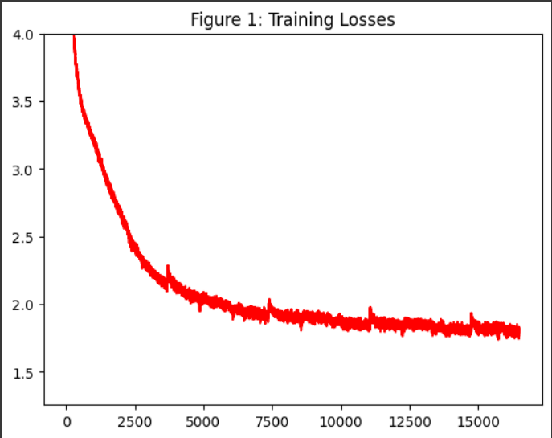
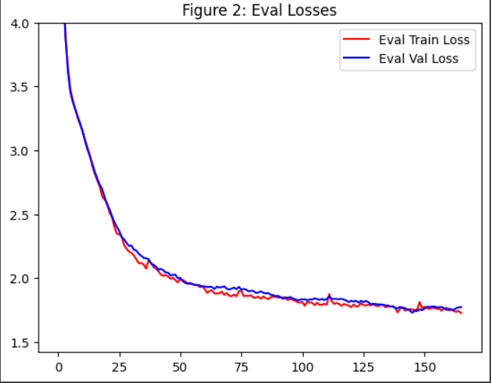

# Transformer Language Model with Byte Pair Encoding (BPE)

## Overview

This project involves a Transformer-based language model trained using Byte Pair Encoding (BPE) for tokenization. 
The goal is to create a language model and tokenizer entirely from scratch, apart from using fundamental libraries, to gain a deeper understanding of how language models work internally and how they are implemented.
The objective is not to create a model comparable to GPT but to emphasize the learning experience. 
Due to computational limitations, this is a 15M parameter model trained on a dataset of ~4.5GB of text.
If this model and dataset were scaled by ~50x, it might resemble something closer to GPT-3. 
Although the model is not sufficient for general use, it serves well for demonstration purposes, which is the focus of this project.

 
The project is organized into the following key components:

1. **`BPE.py`**: Implements the BPE algorithm for text encoding and decoding.
2. **`Train.py`**: A script for training the initial Transformer model.
3. **`Transformer.py`**: Contains the definition of the Transformer model.
4. **`FineTune.py`**: Handles the fine-tuning of the pre-trained Transformer model.
5. **`TestModel.py`**: Provides an interface for interacting with both the base and fine-tuned model.
6. **`Datasets/`**: Contains dataset files, though not in GitHub, including tokenizers and trained models.

## File Descriptions

### `BPE.py`

This file defines the `BytePairEncoding` class used for text tokenization. Key features include:
- **Text Encoding**: Converts text into a sequence of tokens using BPE.
- **Text Decoding**: Converts sequences of tokens back into text.
- **Training BPE**: Creates a BPE tokenizer based on a text corpus.
- **Saving and Loading**: Allows saving and loading the tokenizer.

### `Train.py`

This script is used for training the initial Transformer model before fine-tuning. It includes:
- **Model Training**: Defines and trains the Transformer model from scratch or from a pre-trained state.
- **Loss Monitoring**: Tracks and logs training and validation losses.
- **Checkpointing**: Saves model checkpoints during training.

### `Transformer.py`

Defines the architecture for the Transformer-based language model, including:
- **Model Definition**: Configuration of the model, including embedding size, number of heads, layers, etc.
- **Forward Pass**: Implementation of the forward pass for the model.

### `FineTune.py`

This script is used for fine-tuning the pre-trained Transformer model on a specific dataset. Key functionalities include:
- **Data Preparation**: Reads and preprocesses the training data.
- **Model Training**: Fine-tunes the model with specified hyperparameters.
- **Model Interaction**: Allows user to interact with the model after fine-tuning.

### `TestModel.py`

Provides a script that allows users to interact with the fine-tuned model. Features include:
- **Model Loading**: Loads the fine-tuned model and tokenizer.
- **Text Generation**: Allows the user to input text and receive model-generated responses.

## Training and Validation Losses

The model was first created and trained through the `Train.py` script.  
Specific outputs of each evaluation interval can be seen in `TrainingResult.txt`.

### Training Loss
Figure 1. This is the training loss of the model across 16,500 iterations in the pre-training stage.

### Validation Loss
Figure 2. This is the training/validation loss at every 100 iterations.

Loss steadily decreases until ~12k iterations where it starts leveling out.

 

## Pre-Trained Model Generation Samples

Below are sample generations from the pre-trained model.

`Enter: What are windmills?`
 
`-`To protect the wind when the air is in the air, it cannot be damaged by wind or other airborne wind. To protect the wind?
 
`-` To protect the wind or in the wind, use a wip to protect the windmill's windows and windows in the wind and wind that
 

`Enter: Doctors are`
 
working for you.
They may also be used for any medicine. At the time your doctor may recommend a physician for you, but the doctor may suggest that this is an effective treatment.
 

`Enter: If you notice any symptoms`
 
of this condition, see the doctor immediately.
A few days after the first treatment, a few days or weeks of treatment.
A few days after the first treatment, see your doctor.
 
 

As you can see, when given an input to start with, the model attempts to continue the generation. 
Although it's not very coherent, there are some clear signs of grammatical and syntactical learning through pretraining.
Other times, it returns nonsensical text, as shown below, which can be improved by using a more refined/expansive dataset.

 

`Enter: The civil war`
 
started the battle, and the war. A war started the war against the British during the war. This war ended in 1776, when he died, and then the British flew the war against the British in 1779, and became a victory against the British. On Nov
 

`Enter: In the year 2000`
 
the United States was the first state to be reported to the Congressional Society in Berlin.The government was confirmed by U.S. Supreme Court, and the state of Connecticut was confirmed by U.S. Supreme Court.The Supreme Court
 

`Enter: This is a language model that`
 
is also used in the English language.
The first language is English, though in Latin English. The language also was spoken in the late 1250s. The language is the spoken language for many people.
The second language is spoken in the English language. The language spoken

 

## Fine-Tuning Results

After pre-training, the model was fine-tuned using `FineTuneDS.txt`, a small dataset containing ~1050 samples.
Format is `Question?Answer` style, with samples separated by a newline.
 
Here are some examples of the Fine-Tuning Dataset:

`What are the benefits of rambutan? Rambutan is rich in vitamin C and iron, which can improve immunity and energy levels.`

`Can gooseberries improve my skin? Gooseberries are high in vitamin C, which helps with collagen production and skin health.`

`Should I eat honeydew for better hydration? Honeydew is rich in water and electrolytes, making it excellent for hydration.`

`What are the benefits of soursop? Soursop is high in antioxidants and vitamin C, which may help reduce inflammation and boost immune health.`

`Can jujube improve sleep? Jujube is known for its calming effects and may help improve sleep quality.`

 

The `FineTune.py` then takes in that .txt file, preprocesses the data, and tunes the given model to focus on that specific dataset

Below are samples generation from the pre-trained model.

`Enter: What fruits improves the skin?`
 
Yes, Pears are high in antioxidants, which improve skin function.

`Enter: Are strawberries healthy?`
 
Yes, Yellow strawberries are rich in antioxidants and supports immune function.

`Enter: Should I eat kiwi?`
 
Kiwi is rich in antioxidants, fiber, and fiber, which supports skin health and improve skin condition.

### Model Overfitting Observation

Likewise, there are others that doesn't make a lot of sense,

`Enter: Hello`
 
for bone health? Yes, Yellows contain antioxidants that support skin health and skin health.

`Enter: Computers are`
 
high in fiber and antioxidants, which can support heart health, reduce cholesterol levels and help with bone repair and support digestion.

`Enter: The in modern world`
 
of water is high in vitamin C and antioxidants which can support digestive health.

 
This overfitting occurs because the model adapts too closely to the limited fine-tuning dataset, focusing on health-related subjects even in unrelated prompts. 

This overfitting can be addressed through:
- **Larger, more diverse fine-tuning datasets**, which would allow the model to generalize better.
- **Regularization techniques** like dropout or weight decay during fine-tuning to prevent the model from becoming too specialized.
- **Early stopping**, where training is halted once performance on the validation set begins to degrade.

 

### Note
You may notice that two `BPE.py` files exist. They are identical. The duplicate exists due to how the tokenizer was pickled using the pickle library. Initially, the tokenizer and `BPE.py` was created within the `Datasets` folder, but upon pickling and moving the tokenizer to the main directory for training, it threw an error when unpickling, as it expects `BPE.py` to be on the same level as it was when originally pickled.

 

## Acknowledgments
Part of the code in `BPE.py` was adapted from work by Andrej Karpathy, available at https://github.com/karpathy/minbpe.
